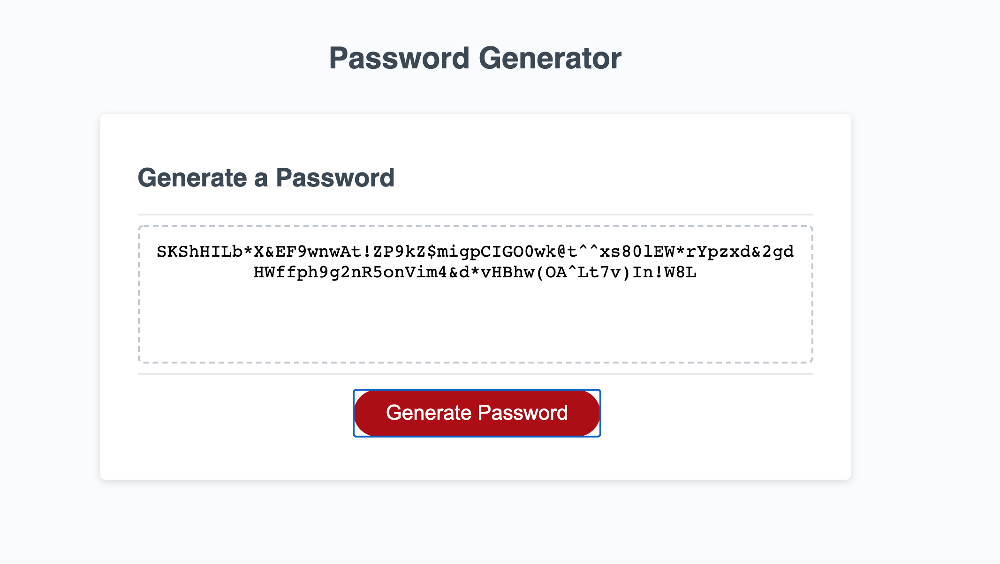

## JavaScript: Password Generator

For this assignment I created a random password generator that can use uppercase letters, lowecase letters, numbers and special characters. 

## HTML/CSS
the HTML and CSS files were already created and I did not make any edits to either file. 

## JS
I used JS to  bring the application to life. See below for the steps I took to make the application work properly

- I set all of my variables for potential passowrd characters. This included min password length, max password length, uppers, lowers, numbers and symbols.
- I set my promps that show up on the page after hitting the generate password button asking the user how long they want their password to be and what type of characters to include. 
- I set a while loop to make sure the user chooses a password length within the max and min requirements. If they choose soemthing outside of that, the loop will ask them to select something else within the requirements. 
- I set 4 if statements asking the password generator to include the uppers, lowers, numbers and special characters in the password if the user selected yes.
- I set a for loop to ensure the password generated the amount of charatcers the user selected when asked how long they want the password to be. 
- I set a function to generate the password

## Screenshot of project

## Deployed Link 

